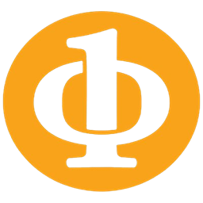

<h1>Hi, I am Egor! 👋</h1>

- 🏢I'm Software Engineer @ Stablein Solutions (Tampa, FL startup)
- 🏫Computer Science and Math student at the University of South Florida '27
- 🧑‍🏫Tech Lead @ IEEE Computer Society at the  University of South Florida
  
<!--- 👨‍💻I am currently learning a bunch of stuff-->

<!---  -->

 
 

 

 
 

 

## Contact me:

  

## My projects that I am actually proud of👇

 <!-- -->

- [ieeecsusf.com](https://www.ieeecsusf.com) - Full-stack website for IEEE Computer Society at USF with auto-synced events, headless CMS, and an admin panel
- [techxflorida.com](https://www.techxflorida.com) - Landing site and registration hub for TechX Florida, a tech conference organized by IEEE Computer Society at USF

 <!-- #  -->

